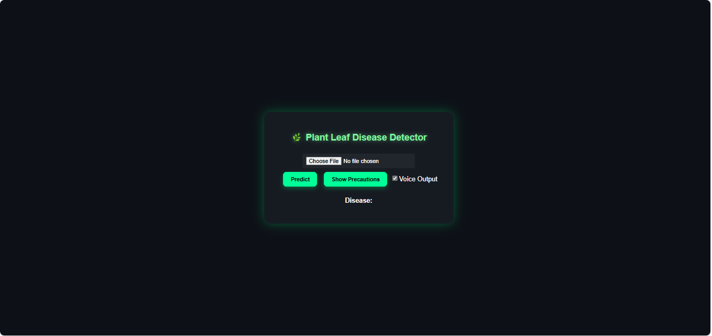
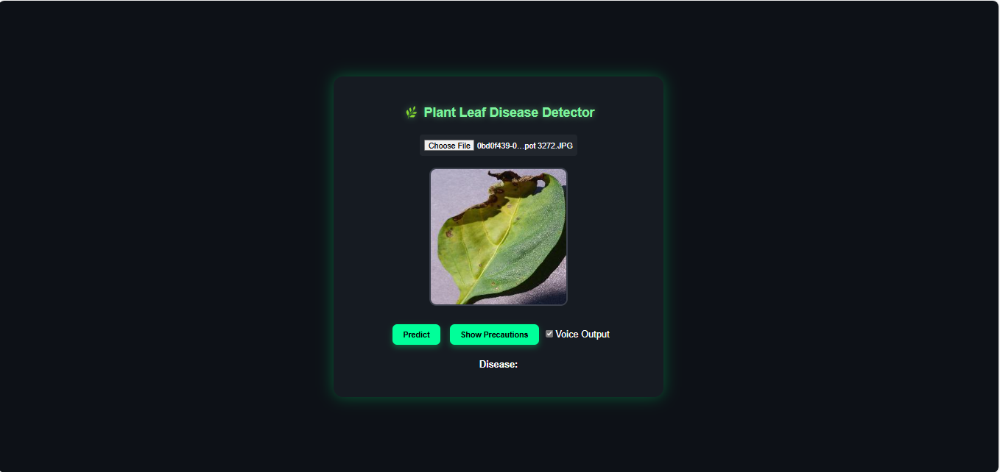
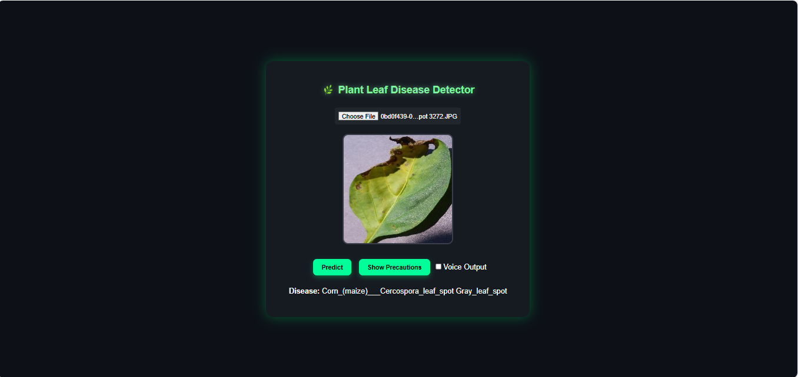
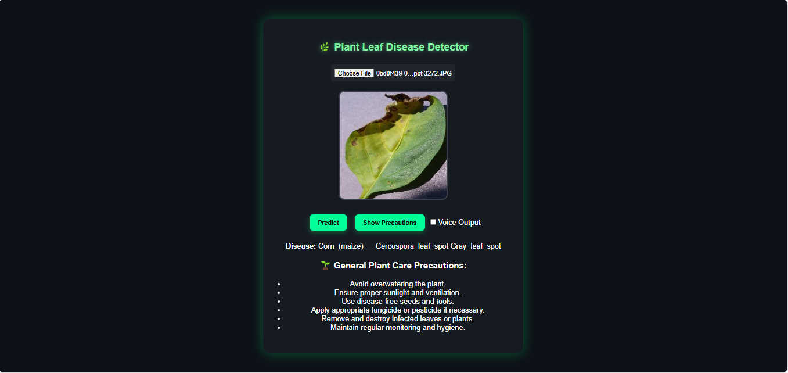

# 🌿 Plant Leaf Disease Detection using Machine Learning

A full-stack web application to detect diseases in plant leaves using a **Convolutional Neural Network (CNN)** model. Users can upload a leaf image and receive disease predictions with confidence score and precautionary advice. Designed for accessibility and ease of use.

---

## 🧠 Overview

- **Goal**: Detect plant leaf diseases through image classification  
- **Model**: CNN (trained on PlantVillage dataset)  
- **Accuracy Achieved**: ~94% on validation data  
- **Frontend**: React (Vite)  
- **Backend**: Flask (Python)  
- **Voice Output**: Basic browser-based speech synthesis for prediction result  
- **Deployment**: Locally run on different ports using Flask + React

---

## 📁 Folder Structure

```
plant-disease-app/
│
├── backend/
│   ├── app.py                         # Flask server with prediction route
│   ├── saved_model/
│   │   └── plant_disease_model.h5     # Trained CNN model
│
├── frontend/
│   ├── src/
│   │   └── App.jsx                    # React UI logic
│   ├── index.html
│
├── images/                            # Screenshots for README
│   ├── homepage.png
│   ├── uploading.png
│   ├── prediction_result.png
│   ├── precautions.png
│
├── requirements.txt                   # Backend Python dependencies
└── README.md
```

---

## ⚙️ How to Run the Project Locally

### 🔧 1. Clone the Repository

```bash
git clone https://github.com/Chandini7203/plant-disease-app.git
cd plant-disease-app
```

### 🧪 2. Setup and Start the Backend

> Make sure you're in the root directory

```bash
pip install -r requirements.txt
cd backend
python app.py
```

### 🌐 3. Start the Frontend

```bash
cd ../frontend
npm install
npm run dev
```

Now visit: [http://localhost:5173](http://localhost:5173)

---

## 📸 Screenshots

- **🏠 Homepage**  
  

- **📤 Image Upload**  
  

- **📊 Prediction Result**  
  

- **💡 Precaution View**  
  

---

## ✅ Features

- 📷 Upload leaf image to predict disease  
- ⚡ Fast and accurate CNN predictions  
- 📢 Voice output using browser TTS (no external APIs)  
- 🌱 Precautions displayed for each disease  
- 💻 Simple, responsive, and user-friendly interface

---

## 📌 Technologies Used

| Component   | Tools/Frameworks             |
|-------------|-------------------------------|
| Frontend    | React (Vite), HTML, CSS, JS   |
| Backend     | Flask, Flask-CORS, Python     |
| Model       | TensorFlow, Keras, NumPy      |
| Utilities   | Pillow (PIL), SpeechSynthesis |
| Dataset     | [PlantVillage on Kaggle](https://www.kaggle.com/datasets/emmarex/plantdisease)

---

## 🧠 Model Details

- **Architecture**: CNN with custom layers  
- **Input Size**: 128x128 pixels  
- **Activation**: Softmax on final layer  
- **Loss**: Categorical Crossentropy  
- **Optimizer**: Adam  
- **Epochs**: 5  
- **Accuracy Achieved**: ~94%

---

## 🚀 Git Commands to Push Changes

```bash
git add .
git commit -m "Updated frontend/backend with final model and UI"
git push origin main
```

---

> ⚠️ This project is designed for local usage. For deployment on cloud platforms, you will need to configure CORS, update API URLs, and ensure model size is suitable for hosting limitations.
